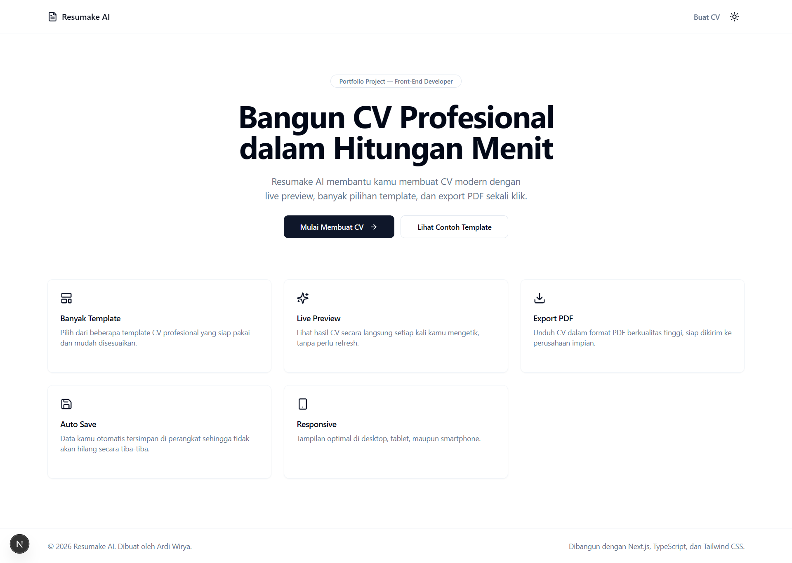
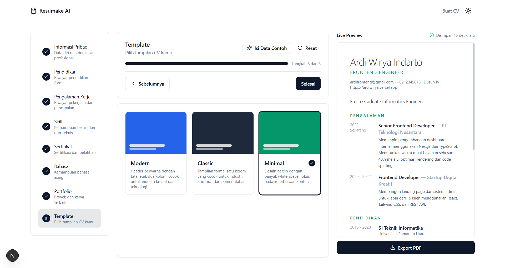

# Resumake AI

Aplikasi pembuat CV modern berbasis web yang memungkinkan pengguna menyusun resume profesional melalui form multi step, melihat hasilnya secara langsung lewat live preview, dan mengekspornya sebagai file PDF siap kirim. Proyek ini dibangun sebagai portfolio front-end dengan arsitektur yang scalable, type-safe, dan mengikuti best practice Next.js App Router. 

Live Demo : [Resumake AI](https://resumake-ai.vercel.app)

## Preview



## Fitur

- Form multi step dengan progres yang jelas dan validasi di setiap langkah
- Informasi pribadi lengkap (nama, kontak, ringkasan profesional, tautan sosial)
- Riwayat pendidikan dengan dukungan status "masih menempuh pendidikan"
- Riwayat pengalaman kerja dengan dukungan status "masih bekerja di sini"
- Manajemen skill dengan level kompetensi (pemula hingga ahli)
- Sertifikat dan pelatihan lengkap dengan tautan kredensial
- Kemampuan bahasa dengan level kefasihan
- Daftar portfolio atau proyek unggulan
- Beberapa pilihan template CV (Modern, Classic, Minimal)
- Live preview yang memperbarui tampilan CV secara langsung saat form diisi
- Export CV ke file PDF dengan tata letak profesional
- Auto save otomatis ke local storage sehingga data tidak hilang saat halaman ditutup
- Tombol isi data contoh untuk mencoba aplikasi secara instan
- Tampilan responsif untuk desktop, tablet, dan mobile
- Dukungan dark mode dengan preferensi tersimpan

## Tech Stack

- [Next.js 15](https://nextjs.org/) (App Router)
- [TypeScript](https://www.typescriptlang.org/)
- [Tailwind CSS](https://tailwindcss.com/)
- [shadcn/ui](https://ui.shadcn.com/) sebagai basis komponen UI
- [React Hook Form](https://react-hook-form.com/) untuk manajemen form
- [Zod](https://zod.dev/) untuk validasi skema
- [Zustand](https://zustand-demo.pmnd.rs/) untuk state management dan auto save
- [TanStack Query](https://tanstack.com/query/latest) untuk pengelolaan data asinkron
- [Framer Motion](https://www.framer.com/motion/) untuk animasi antarmuka
- [React PDF](https://react-pdf.org/) untuk pembuatan dan export dokumen PDF
- [next-themes](https://github.com/pacocoursey/next-themes) untuk dark mode
- [Lucide Icons](https://lucide.dev/) untuk ikon antarmuka

## Struktur Folder

```
resumake-ai/
├── docs/
│   └── screenshots/            Tempat menyimpan gambar preview untuk README
├── public/                     Aset statis
├── src/
│   ├── app/
│   │   ├── builder/page.tsx    Halaman utama pembuat CV
│   │   ├── globals.css         Variabel tema dan style global
│   │   ├── layout.tsx          Root layout dan metadata
│   │   └── page.tsx            Landing page
│   ├── components/
│   │   ├── builder/            Komponen form multi step dan navigasinya
│   │   │   └── steps/          Form untuk setiap langkah (pendidikan, skill, dll)
│   │   ├── layout/              Header, theme provider, query provider
│   │   ├── pdf/                 Dokumen dan tombol export PDF
│   │   ├── preview/              Live preview dan template CV
│   │   │   └── templates/       Modern, Classic, Minimal
│   │   ├── shared/               Komponen reusable lintas fitur
│   │   └── ui/                   Komponen dasar bergaya shadcn/ui
│   ├── hooks/                    Custom hooks
│   ├── lib/
│   │   ├── validations/          Skema Zod per step
│   │   ├── dummy-data.ts         Data contoh untuk demo cepat
│   │   └── utils.ts              Fungsi utilitas bersama
│   ├── store/
│   │   └── resume-store.ts       Zustand store dengan persist ke local storage
│   └── types/
│       └── resume.ts             Definisi tipe data resume
├── components.json               Konfigurasi shadcn/ui
├── next.config.ts
├── tailwind.config.ts
├── tsconfig.json
└── package.json
```

## Instalasi

Pastikan Node.js versi 18 atau lebih baru sudah terpasang.

```bash
# 1. Clone repository
git clone https://github.com/ardiwirya/resumake-ai.git
cd resumake-ai

# 2. Install dependencies
npm install

# 3. Jalankan development server
npm run dev
```

Aplikasi akan berjalan di `http://localhost:3000`.

## Skrip yang Tersedia

| Perintah            | Deskripsi                                           |
| ------------------- | --------------------------------------------------- |
| `npm run dev`       | Menjalankan aplikasi dalam mode development         |
| `npm run build`     | Membuat build production                            |
| `npm run start`     | Menjalankan build production secara lokal           |
| `npm run lint`      | Menjalankan ESLint                                  |
| `npm run typecheck` | Memeriksa tipe TypeScript tanpa menghasilkan output |

## Alur Penggunaan

1. Buka halaman `/builder` untuk mulai membuat CV, atau klik tombol Isi Data Contoh untuk mencoba dengan data dummy.
2. Isi setiap langkah form: informasi pribadi, pendidikan, pengalaman kerja, skill, sertifikat, bahasa, dan portfolio.
3. Pilih template CV yang diinginkan pada langkah terakhir.
4. Pantau hasilnya secara langsung melalui panel Live Preview di sisi kanan.
5. Klik tombol Export PDF untuk mengunduh CV dalam format PDF.
6. Data tersimpan otomatis di local storage sehingga dapat dilanjutkan kapan saja tanpa kehilangan progres.

## Rencana Pengembangan

- Integrasi AI untuk menyarankan kalimat ringkasan dan deskripsi pengalaman kerja
- Tambahan pilihan template CV
- Fitur berbagi CV melalui tautan publik
- Sinkronisasi data lintas perangkat dengan autentikasi pengguna

## Lisensi

Proyek ini dilisensikan di bawah [MIT License](LICENSE).

Copyright (c) 2026 Ardi Wirya
